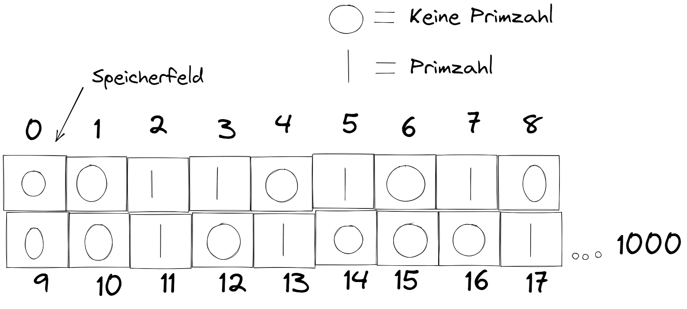

**Analyse der Aufgabenstellung**

Es soll ein Programm entworfen werden, welches mit hilfe des Algorythmusses Sieb des Erathosthenes die Primzahlen von 2 bis 1000 errechnet.

Dies soll in Assambler Code umgesetzt werden.

**Aufbau des Programms**

;prim fill 1000,1,1 ein Feld mit einem byte in dem die Stelle des Elements für die Zahl steht

;lade die Adresse von prim in R0

;lade die Konstante 0 in R1

;speichere die Konstante 0, welche in R1 steht, in einem byte ab der Adresse aus R0

;speichere die Konstante 0, welche in R1 steht, in einem byte ab der Adresse aus R0 mit 1 byte dazuaddiert

;lade die Konstante 2 in R2

;Beginn der Schleife solange R2 \* R2 <= 1000 ist führe aus

\{

> ;lade in R4, \[R0+R2\]

> \;if R4 ungleich 0 führe aus

> \{

> > ;mov R3, R2

> > ;Beginn der Schleife solange \(R2\*R3\)<=1000 führe aus

> > \{

> > > ;strb R1, \[R0,\(R2\*R3\)\]\

> > > ;add R3,#1

> > \}

> \}
> 
;add R2,#1

\}

**Skizze des Speichers**

